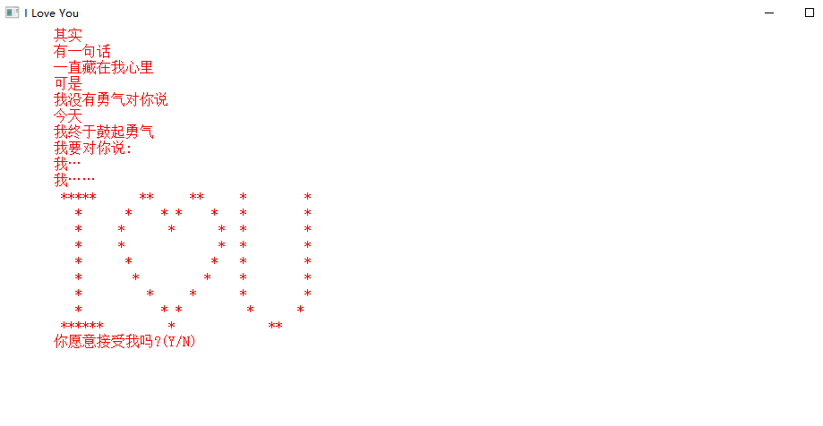
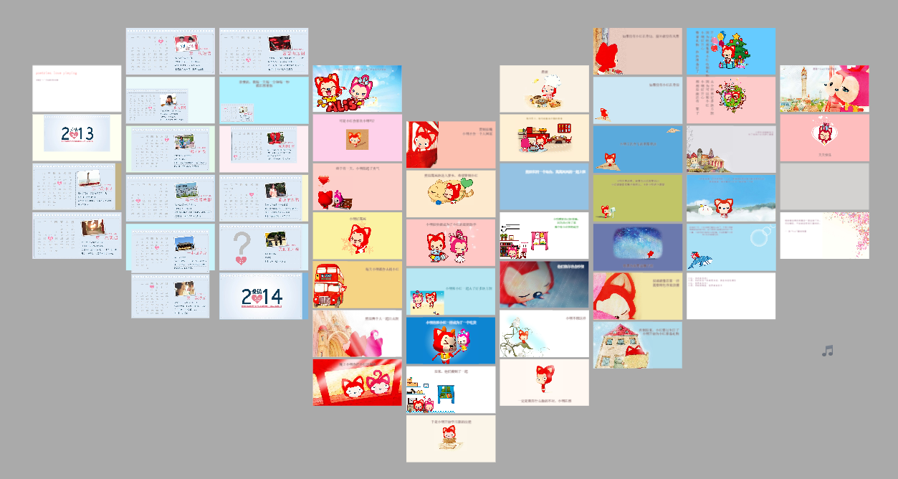
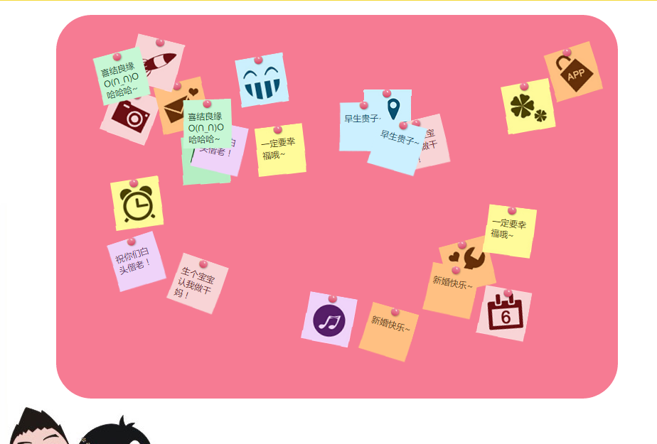
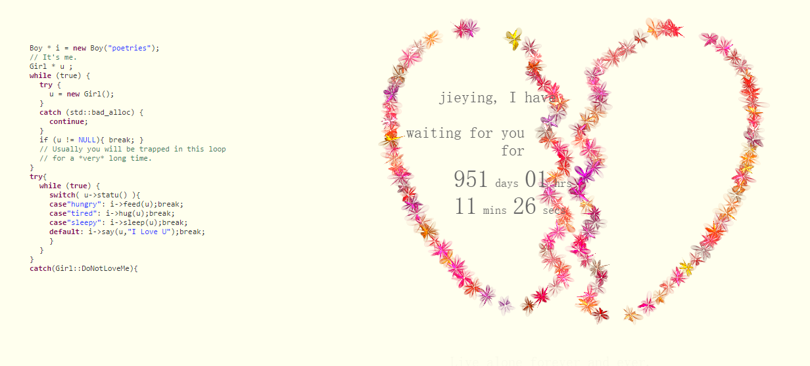

### 整理程序员的浪漫表白网页源代码

---

- **在线链接形式**

  - [phodal做的一个表白神器](https://github.com/phodal/valentine)
  
  - [利用地图的方式，十分有创意](http://liumeijun.com/)
  
    
	
---

- **本地源码**

  - [C语言实现的一个表白程序](./project/c表白)
  
  
  - [c++实现的一个表白程序](./project/c++表白)
  
  
  - [999+1朵玫瑰](./project/999+1朵玫瑰)
  
  
  - [程序员像妹子表白专用代码](./project/程序员像妹子表白专用代码)
  
  
  
  - [PPT形式展示-键盘控制](./project/键盘控制播放)
  
  
  - [jquery版小型婚礼(可动态添加祝福语)](./project/jquery版小型婚礼(可动态添加祝福语))
  
  
  - [心+文字闪烁](./project/心+文字闪烁)
  
  
  - [心+雪花飞舞](./project/心+雪花飞舞)
  
  
  - [心形](./project/心形)
  
  

> 收藏面试题地址 [http://interview.poetries.top](http://interview.poetries.top)，精选海量面试题型
